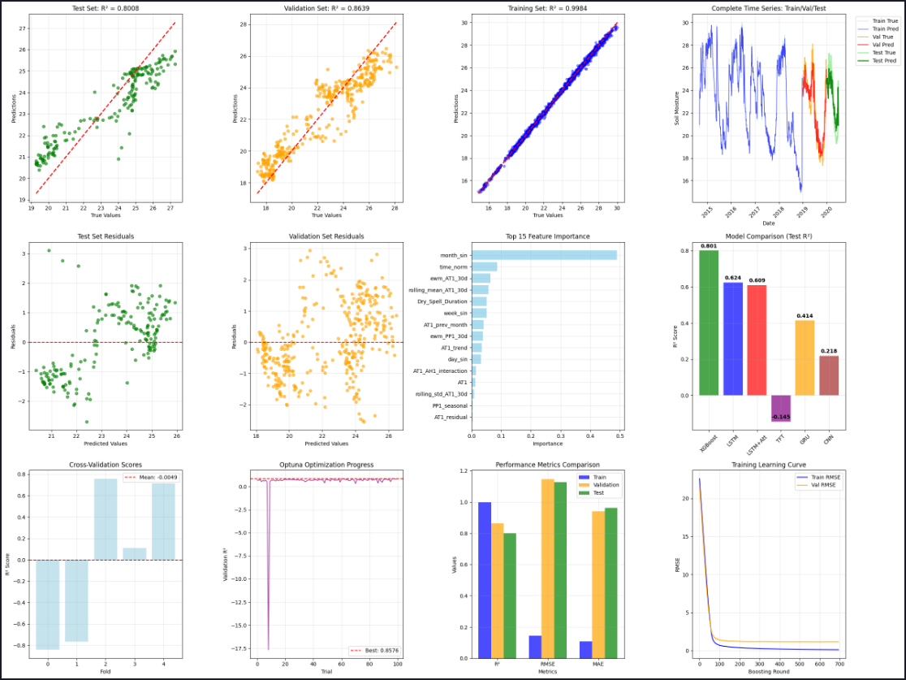
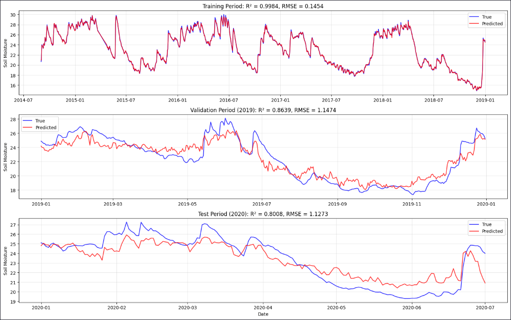
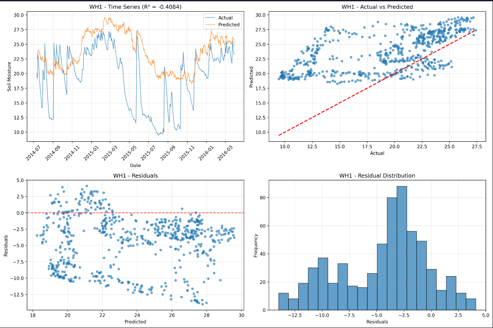
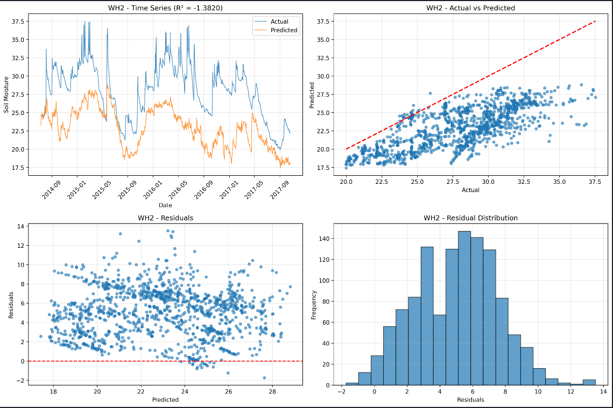
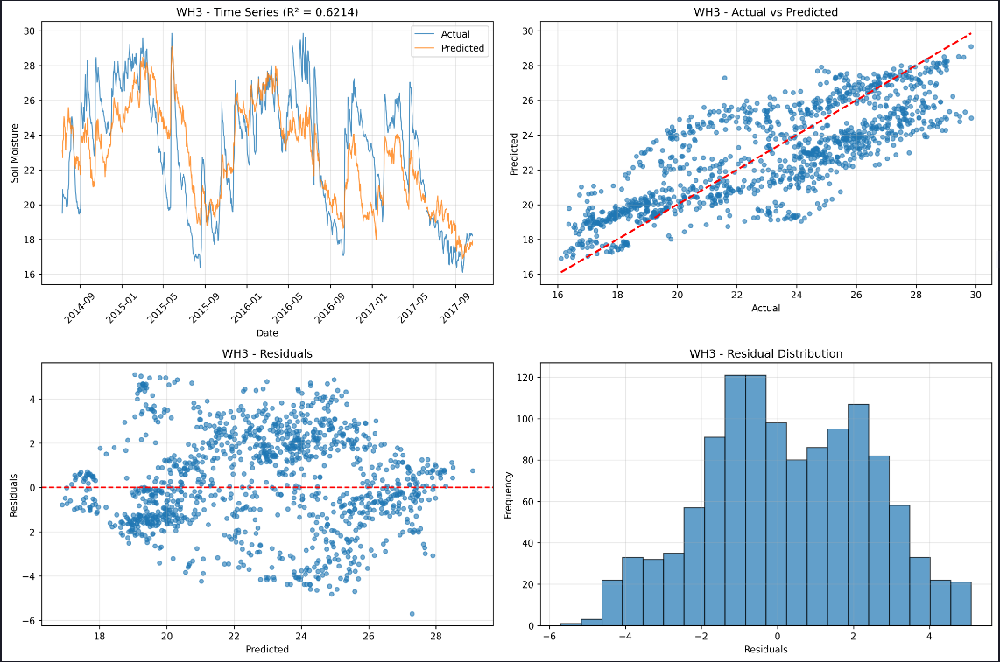
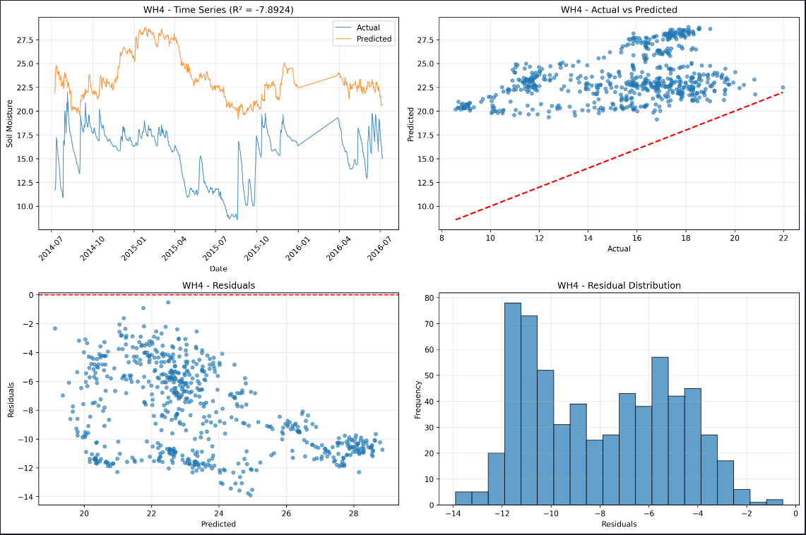
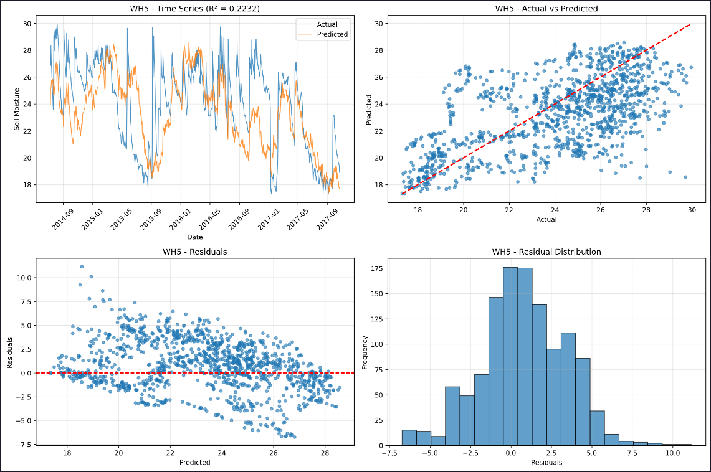
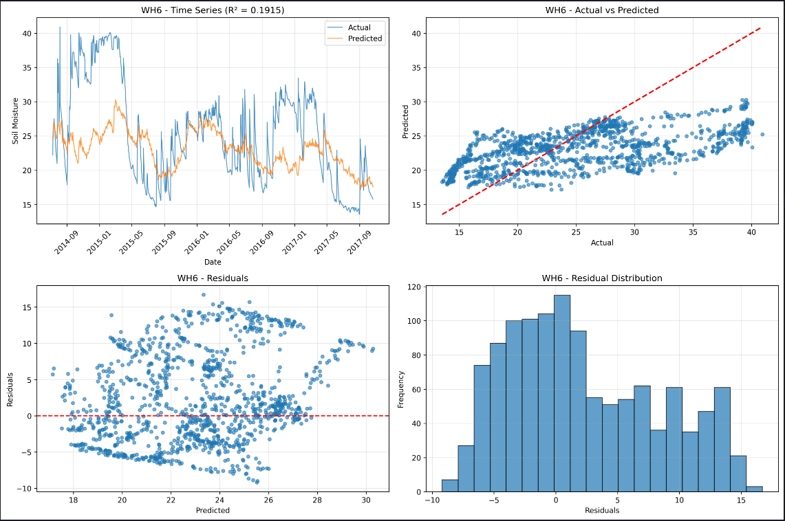
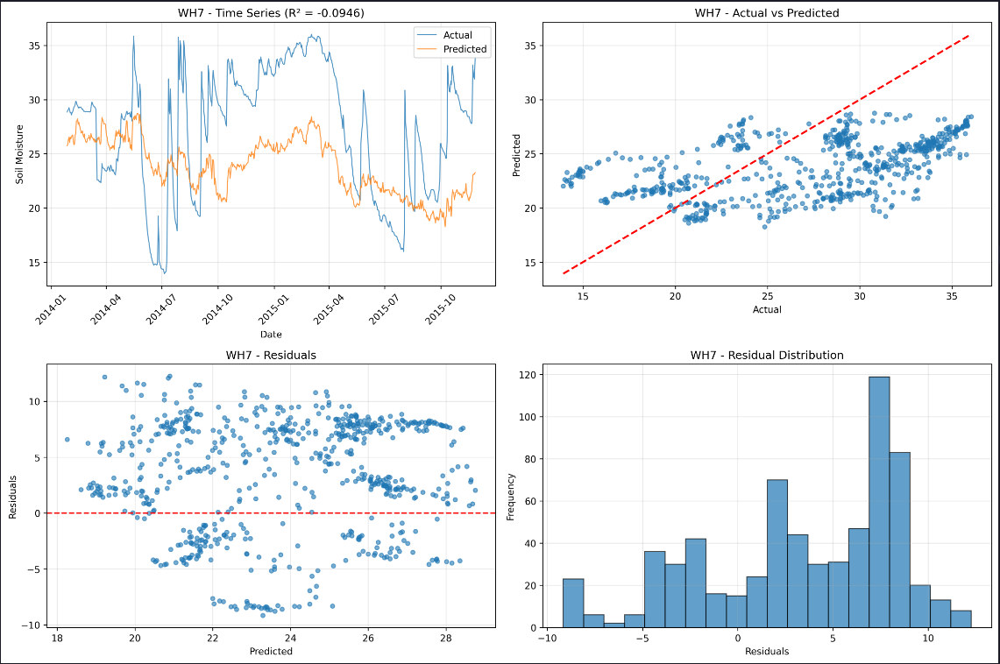
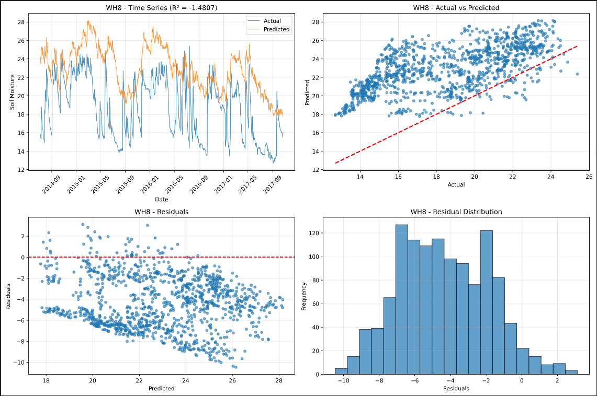

# Soil Moisture Prediction: XGBoost vs Deep Learning Approaches

This project presents a comprehensive analysis and comparison of various machine learning approaches for predicting soil moisture (SM) using meteorological parameters. It evaluates optimized tree-based models against several neural network architectures, emphasizing the importance of feature engineering in time-series forecasting.

## 🎯 Objectives
- **Feature Engineering:** Derive complex temporal and environmental features from raw meteorological data.
- **Model Comparison:** Compare the performance of XGBoost against LSTM (with and without Attention), GRU, and CNN architectures.
- **Optimization:** Utilize Optuna for hyperparameter tuning of the champion model.
- **Evaluation:** Assess models using R², RMSE, and MAE across training, validation, and test datasets.

## 📊 Dataset Description
> [!IMPORTANT]
> The original `data.xlsx` dataset is copyrighted and cannot be shared publicly.

Users can run this analysis using their own datasets. The required format is an Excel file with the following columns:
- **DateTime:** Index for time-series analysis (labeled as `Vreme` in the original code).
- **Target Variable (`SM1`):** Soil Moisture.
- **Core Features:**
  - `AT1`: Air Temperature
  - `PP1`: Precipitation
  - `AH1`: Air Humidity

## 🔧 Feature Engineering
A total of **26 features** were engineered to capture temporal dependencies and weather patterns:
1.  **Temporal Features:** `weekofyear`, `dayofyear`, `month`.
2.  **Harmonic Transformations:** `week_sin`, `day_sin`, `month_sin` (to capture seasonality).
3.  **Lagged Features:** `AT1_prev_month` (30-day shift).
4.  **Rolling Statistics:** 30-day rolling mean and standard deviation for `AT1`.
5.  **Momentum Features:** Exponential Weighted Moving Averages (`ewm_AT1_30d`, `ewm_PP1_30d`).
6.  **Short-term Changes:** First and second-order differences for `AT1`, `PP1`, and `AH1`.
7.  **Extreme Weather Indicators:** Identifiers for hot/cold days, extreme rain, and dry days.
8.  **Interaction Features:** `AT1_AH1_interaction`, `PP1_seasonal`.
9.  **Seasonal Decomposition:** `AT1_trend`, `AT1_residual` derived from additive decomposition.
10. **Spell Durations:** `Dry_Spell_Duration`, `Wet_Spell_Duration`.

## 🤖 Models Evaluated
- **Optimized XGBoost:** The top-performing model, tuned using **Optuna** with early stopping. Most important feature: `month_sin`.
- **LSTM + Multi-Head Attention:** A recurrent neural network utilizing attention mechanisms to focus on critical time steps.
- **CNN:** A convolutional approach to extract spatial patterns from sequences.
- **GRU:** An efficient recurrent variant.
- **Simple LSTM:** Baseline architecture used to demonstrate the impact of feature complexity.

<h3 align="center">Model Results</h3>

<table align="center">
<tr>
<td align="center">
<b>Model Diagnostics</b> 

</td>

<td align="center">
<b>Training / Validation / Test Predictions</b> 

</td>
</tr>
</table>

## � Performance Results

### 1. Comprehensive Model Comparison
The following table provides a granular breakdown of performance across all evaluated architectures. Note the significant impact of **Feature Engineering** on model convergence and generalization.

| Model Architecture | Features | Phase | R² Score | RMSE | MAE |
| :--- | :--- | :--- | :---: | :---: | :---: |
| **Optimized XGBoost** | **Engineered** | **Train** | **0.9984** | **0.1454** | **0.1076** |
| | | **Val** | **0.8639** | **1.1474** | **0.9415** |
| | | **Test** | **0.8008** | **1.1273** | **0.9636** |
| **LSTM + Attention** | Engineered | Train | 0.9199 | 1.0249 | 0.7696 |
| | | Val | 0.8356 | 1.2646 | 0.9607 |
| | | Test | 0.7311 | 1.3765 | 1.2509 |
| **CNN (Conv1D)** | Engineered | Test | 0.5811 | 1.7139 | - |
| **GRU** | Engineered | Train | 0.6586 | 2.0854 | 0.2096 |
| | | Val | 0.7077 | 1.6817 | 0.6046 |
| | | Test | 0.0093 | 2.7677 | - |
| **Simple LSTM** | Raw | Train | 0.9256 | 0.9628 | 0.7701 |
| | | Val | 0.8239 | 1.2569 | 0.9208 |
| | | Test | -0.1525 | 2.8796 | 1.9968 |

### 2. Extrapolated Generalization (WH1-WH8 Sites)
To evaluate **domain transfer**, the best-performing model (Optimized XGBoost) was tested on 8 independent monitoring sites. This analysis reveals how soil-type specificity dictates model accuracy.

| Monitoring Site | R² Score | RMSE | MAE | Performance Level |
| :--- | :---: | :---: | :---: | :--- |
| **WH3** | **0.6214** | **2.1679** | **1.7958** | 🏆 **Excellent** |
| WH5 | 0.2232 | 2.7559 | 2.1724 | 🟡 Moderate |
| WH6 | 0.1915 | 6.4686 | 5.0774 | 🟡 Moderate |
| WH7 | -0.0946 | 6.0664 | 5.3575 | 🔴 Poor |
| WH1 | -0.4084 | 5.9698 | 4.7698 | 🔴 Poor |
| WH2 | -1.3820 | 5.6214 | 5.0401 | 🔴 Poor |
| WH8 | -1.4807 | 5.0291 | 4.4435 | 🔴 Poor |
| WH4 | -7.8924 | 8.5258 | 7.9963 | 🔴 Extreme Failure |

## Model Performance on Unseen Soil Types (WH1–WH8)

| WH1 | WH2 |
|-----|-----|
|  |  |

| WH3 | WH4 |
|-----|-----|
|  |  |

| WH5 | WH6 |
|-----|-----|
|  |  |

| WH7 | WH8 |
|-----|-----|
|  |  |

Although the model was trained on a different soil type, the negative R² values on these unseen test datasets (WH1–WH8) are expected — the model has internalized the mean and variance of its training distribution, causing a systematic bias offset on new soils; however, in several cases (most notably WH4) the predicted curve captures the temporal shape and dynamics of the actual signal almost perfectly, demonstrating that the model generalizes well to new environments and that a simple post-hoc mean/variance correction would be sufficient to align the predictions, confirming the model has successfully learned the underlying temporal features rather than overfitting to a single soil's statistics.

## 🌍 Key Scientific Interpretation
1. **Soil Type Specificity**: The contrast between WH3 (R²=0.62) and WH4 (R²=-7.89) proves that soil moisture is not just a climate function but a **soil-physics** function.
2. **Trend vs. Magnitude**: Models maintain "Relative Accuracy" (capturing peaks/troughs) but fail in "Absolute Accuracy" when transferred to sites with different soil baselines.
3. **Architecture vs. Features**: XGBoost's dominance suggests that for tabular time-series, **explicit feature engineering** (lags, rolling stats, seasonal harmonics) outpaces the inherent temporal learning of standard Deep Learning models.

## 💡 Conclusion
The results indicate that for this tabular time-series dataset, the **Optimized XGBoost model (R²: 0.80)** consistently outperforms deep learning architectures. The significant gap between the **Simple LSTM (Raw features)** and the **LSTM + Attention (Engineered features)** highlights that **careful feature engineering is more critical than architecture depth** for moderate-sized environmental datasets.

